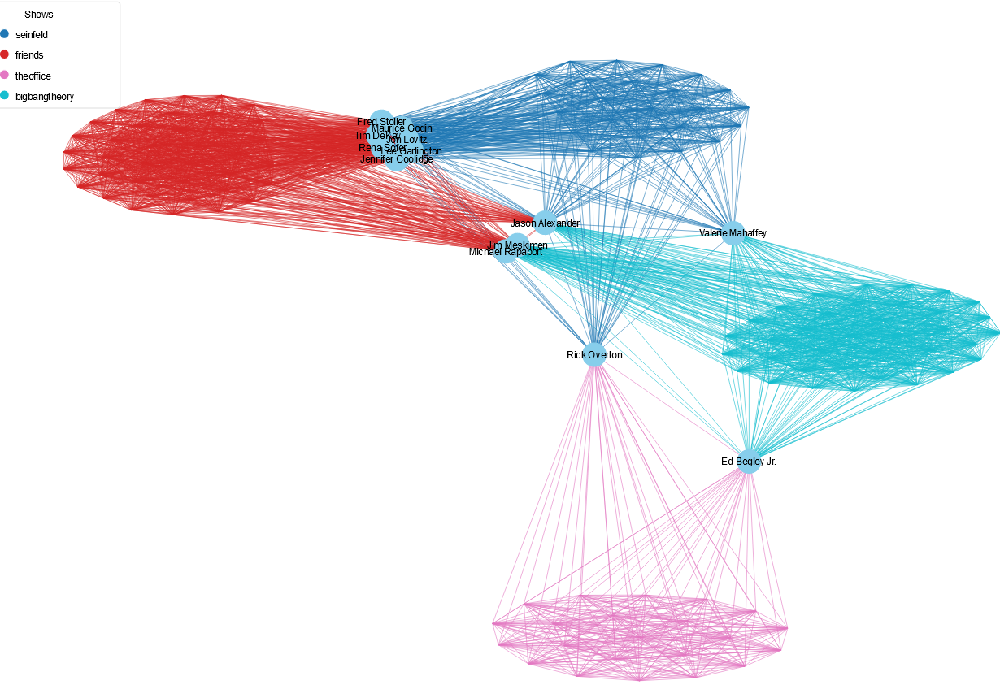
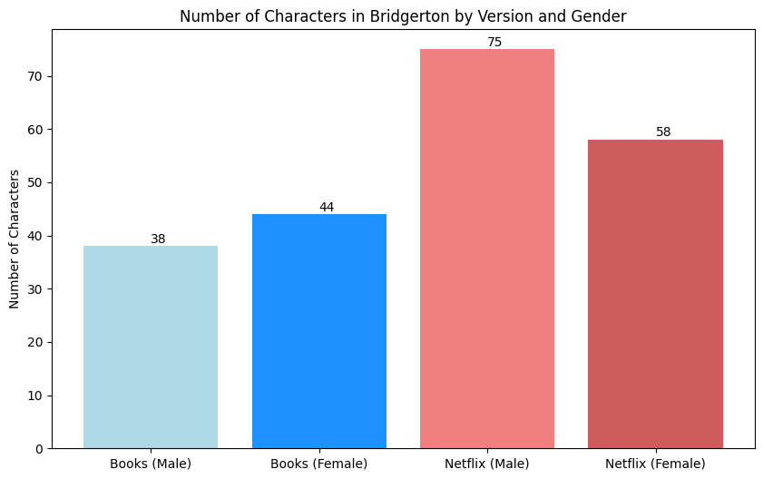
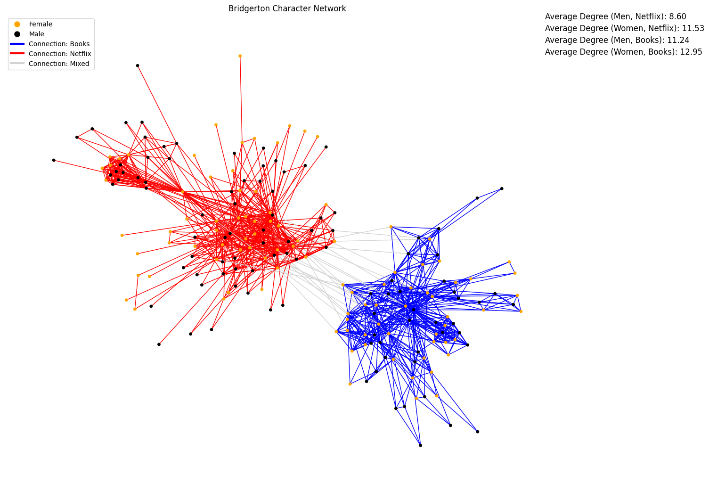
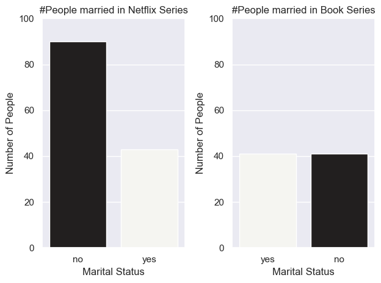
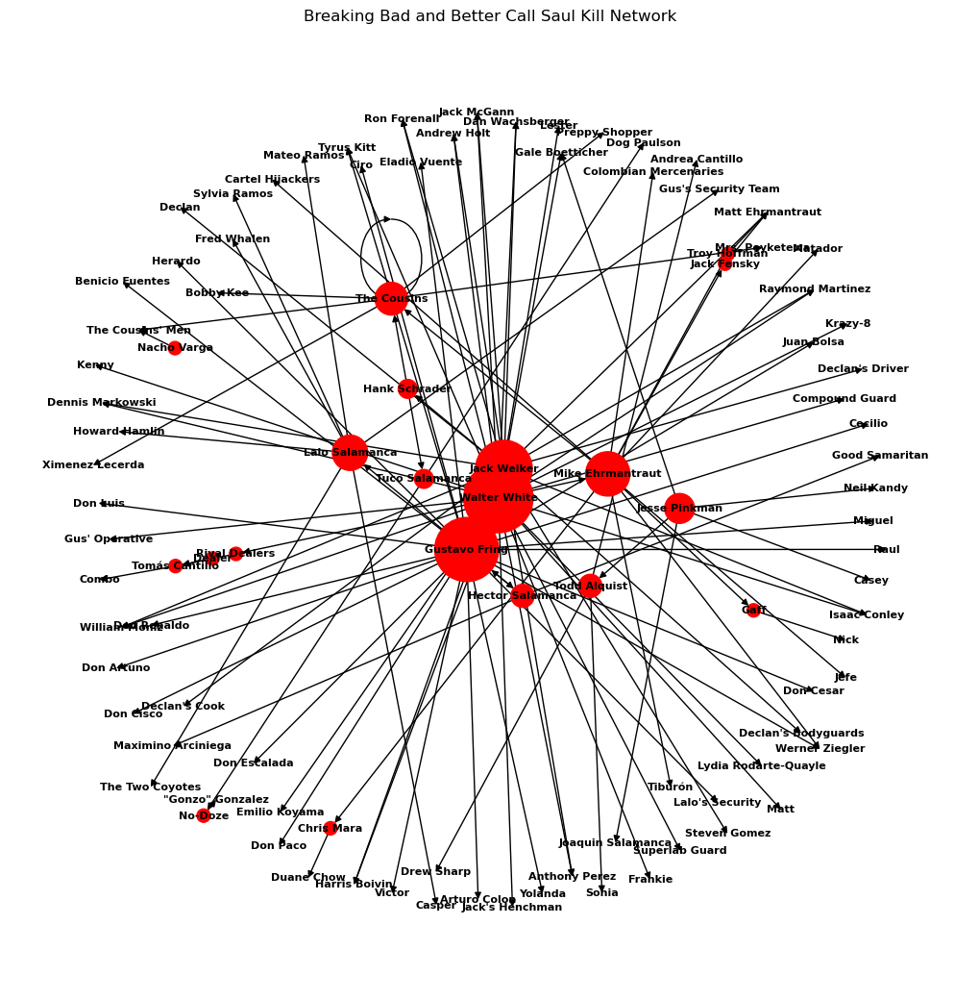
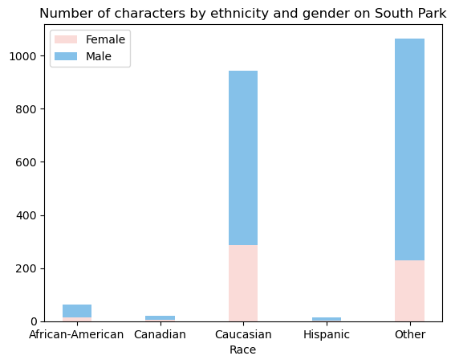
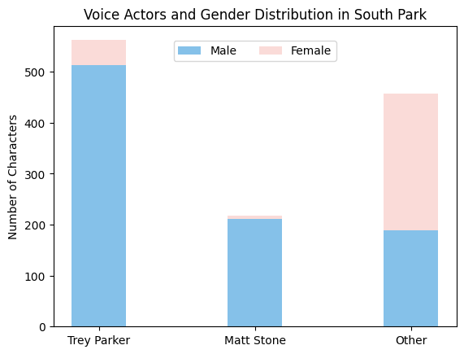
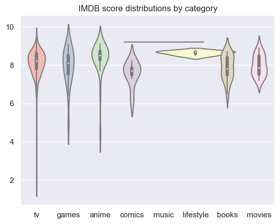
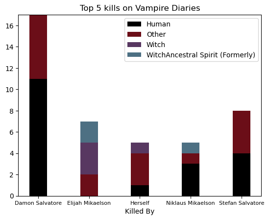
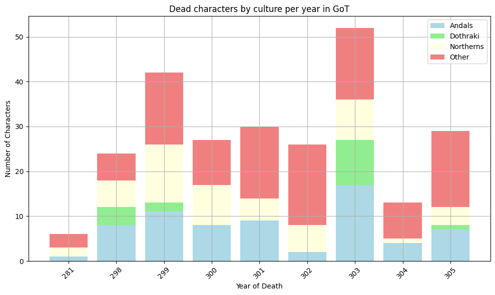

# Challenge 3

Series-networks

## 1: Actor network

## 2: Gender of Bridgerton characters

The creators of the Bridgerton series introduced significantly more new male characters than female ones when adapting the book for the screen.

## 3: Brigerton character network

However, the creation of so many new male characters oddly altered the characters' relationship network. In the series' relationship dynamics, there are significantly more characters who can only be connected to very few other characters (often just one). The creators of the series did not create male characters with as much thought and depth as they did for the female characters. While the average degree of women in the Netflix network is nearly the same as in the book version, the number for men has significantly decreased.

## 4: Bridgerton marriages

Although only 2 seasons of the show have been released so far, compared to the 10+ books, there are significantly more characters present in the former. Proportionally, we can also see a much more uneven distribution in the number of married people. While in the books, it's roughly equal to the number of singles, in the series, there are more than twice as many singles. This effect is presumably mainly because most characters won't find their "true love" until the end of the final season, otherwise there's nothing to keep viewers hooked in front of the TV.

## 5: Kill network

The graph shows which characters from Breaking Bad and Better Call Saul have killed the most characters and who these characters are. The edges point to those who were killed by, starting from the one who killed, and the size of the nodes indicates the kill count of each character.

## 6: Ethnicities in South Park

Although we can see that the most prominent ethnicity is Caucasian, it is also clear that the background of the cast is very diverse. More than half of them do not belong to the four largest ethnicities, although this includes, for example, manbearpigs and aliens. We can also see that women are overrepresented in the Caucasian ethnicity compared to the average of the show.

## 7: Voice actors in South Park

The creators of South Park, Trey Parker and Matt Stone are doing most of the writing, directing and voice acting in the show up to this day. This plot shows how much of the voice acting is done by the two. Trey Parker alone voiced more characters than all the other voice actors of the show. Not surprisingly, most of these are male characters, and only a few female characters are voiced by the creators.

## 8: Distribution of IMDb votes by genre

## 9: Kills in Vampire Diaries

## 10: Deaths in Game of Thrones

## 11: IMDb score and number of votes

## Final 1: Vampire Diaries

## Final 2: Bridgerton

The creators of the Bridgerton series introduced significantly more new male characters than female ones when adapting the book for the screen. However, the creation of so many new male characters oddly altered the characters' relationship network. In the series' relationship dynamics, there are significantly more characters who can only be connected to very few other characters (often just one). The creators of the series did not create male characters with as much thought and depth as they did for the female characters. While the average degree of women in the Netflix network is nearly the same as in the book version, the number for men has significantly decreased. Although only 2 seasons of the show have been released so far, compared to the 10+ books, there are significantly more characters present in the former. Proportionally, we can also see a much more uneven distribution in the number of married people. While in the books, it's roughly equal to the number of singles, in the series, there are more than twice as many singles. This effect is presumably mainly because most characters won't find their "true love" until the end of the final season, otherwise there's nothing to keep viewers hooked in front of the TV.