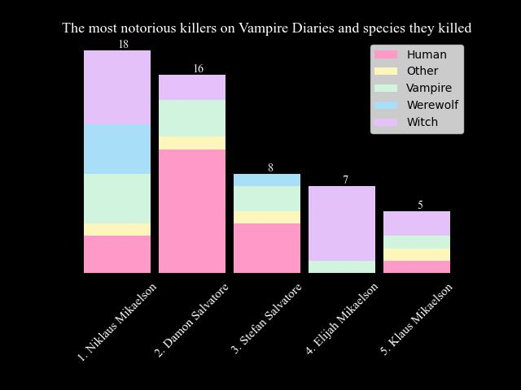
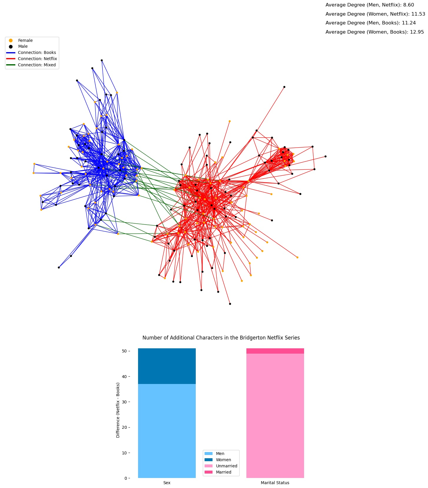

# Challenge 3

Series-networks

## Final 1: Vampire Diaries

This barplot lists the five most notorious killers in the series. There is a huge variety in the species of the characters killed by them.

## Final 2: Bridgerton

The creators of the Bridgerton series introduced significantly more new male characters than female ones when adapting the book for the screen. However, the creation of so many new male characters oddly altered the characters' relationship network. In the series' relationship dynamics, there are significantly more characters who can only be connected to very few other characters (often just one). The creators of the series did not create male characters with as much thought and depth as they did for the female characters. While the average degree of women in the Netflix network is nearly the same as in the book version, the number for men has significantly decreased. Although only 2 seasons of the show have been released so far, compared to the 10+ books, there are significantly more characters present in the former. Proportionally, we can also see a much more uneven distribution in the number of married people. While in the books, it's roughly equal to the number of singles, in the series, there are more than twice as many singles. This effect is presumably mainly because most characters won't find their "true love" until the end of the final season, otherwise there's nothing to keep viewers hooked in front of the TV.